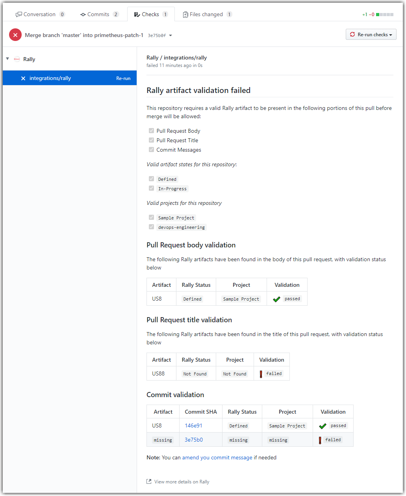
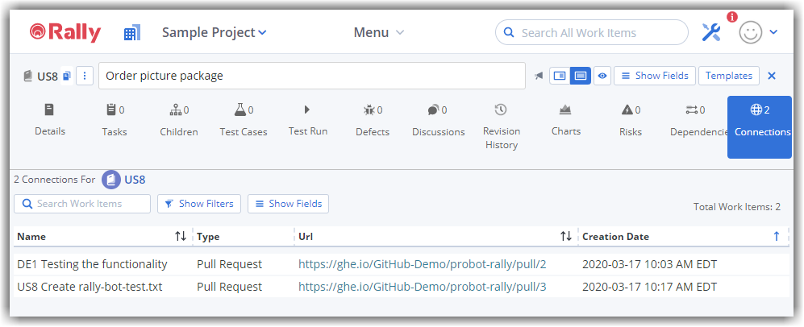

# Rally + GitHub

A **GitHub App** in active development built with [Probot](https://github.com/probot/probot) that integrates [Rally](https://www.broadcom.com/products/software/agile-development/rally-software) (a project management tool) with GitHub. It can be configured to:

- Check the `title` of a Pull Request for valid **Rally** artifacts
- Check the `body` of a Pull Request for valid **Rally** artifacts
- Check the `commit messages` of a Pull Request for valid **Rally** artifacts

The **GitHub App** will update the **Checks API** with success/failure as the conditions are met, and provide a detailed report of the artifacts (i.e. defects, user stories) found and their Flow States in **Rally**.

## Get Started





### How it Works

Every time a pull request is created or updated, `Rally + GitHub` will check for the existence of a **Rally User Story** or **Defect** in the `title`, `body`, or `commit messages`, and then validate that they are in the correct state in **Rally**.

```yml
---
# Name of the GitHub Check
checksName: integrations/rally

# Check PR Body for Rally story/defect (true | false)
checkPRBody: true

# Check PR Title for Rally story/defect (true | false)
checkPRTitle: true

# Check all commit messages for a Rally story/defect (true | false)
checkCommitMessages: true

# Set Rally Flow State to Complete on merge if the PR Body contains "/completes <DEFECT/STORY ID>"
mergeOnPRBody: true

# Comment on the PR in addition to the check message? (true | false)
commentOnPull: false

rally:
  server: https://rally1.rallydev.com

  ## Leave these blank if you use an API key
  ##username: rallyUser
  ##password: rallyPass
  ## This is required if we don't use username/password
  ## NOTE: If you set this in your .env file then you can
  ## leave this commented out. It will override your .env
  #api_key: _1234abc567...

  # Which workspace OID this repo will link to
  workspace: 12345

  # Which projects this repo will link to.
  # To have it connect to any project, leave this value blank
  projects:
    - Sample Project
    - devops-engineering

  # List of valid Rally objects to check
  objects:
    - defect
    #- defectsuite
    #- task
    #- testcase
    #- hierarchicalrequirement
    - userstory
    #- story

  # List of Rally states that an issue must be in in order to pass
  states:
    - Defined
    - In-Progress
```

### Creating the GitHub App on your GitHub instance
- You can follow the detailed documentation at [Creating a GitHub App](https://developer.github.com/apps/building-github-apps/creating-a-github-app/). Below is the condensed version of the documentation
- On your GitHub instance, visit the `settings` page on the Organization that you want to own the **GitHub** App, and navigate to the `GitHub Apps` section.
  - You can access this page by visiting the following url:
    `https://<MY_GITHUB_HOSTNAME>/organizations/<MY_ORG_NAME>/settings/apps`
- Create a new **GitHub App** with the following settings:
  - **Webhook URL**: URL of the machine on which this app has been deployed (Example: `http://ip.of.machine:3000`)
  - **Homepage URL**: URL of the machine on which this app has been deployed (Example: `http://ip.of.machine:3000`)
  - **Webhook Secret**: *REQUIRED* The webhook secret that will be or has been defined as an environment variable in your deployment environment as `WEBHOOK_SECRET`
  - **Permissions**:
    - **Checks**: Read & write
    - **Commit statuses**: Read & write
    - **Contents**: Read-only
    - **Metadata**: Read-only
    - **Pull Requests**: Read & write
    - **Issues**: Read & Write
  - **Events**:
    - **Pull request**
    - **Check run**
    - **Check suite**
    - **Push**

- Once these have been configured, select the `Create GitHub App` button at the bottom of the page to continue
- Make a note of the `APP ID` on your newly-created **GitHub App**. You will need to set this as an environment variable when you configure the app.
- Generate and download a private key from the new App page, and store it in your deployment environment. You can either do this by saving the contents of the key file as the environment variable `PRIVATE_KEY`, or by saving the file directly in the environment and specifying its path with the environment variable `PRIVATE_KEY_PATH`
- After you have created the **GitHub** App, you will need to install it to the desired **GitHub** Organizations.
  - Select `Install App`
  - Select `All Repositories` or the desired repositories you wish to watch

### Deployment

**Rally + GitHub** is based on the **Probot** framework and can be deployed as a standard **NodeJS** application. Ensure that **NPM** is installed in your deployment environment. Also ensure that the following environment variables are configured.
**Note:** You can also deploy as a **Docker** container. Please view the [Docker Deployment Doc](../docs/DockerDeploy.md) for more info.

```bash
# Clone repository to local machine
git clone https://github.com/github/rally

# Change directories into code base
cd rally

# Install all dependencies
npm install

# Create the .env configuration file and update with all needed variables
cp .env.example .env
vi .env
# update .env with configuration variables

# Run the bot
npm start

# Run the bot in the background and output to log
# there are other major ways to achieve this...
# https://github.com/unitech/pm2
# https://github.com/github/auto-fork-sync#running-with-systemd
# https://www.npmjs.com/package/forever
nohup npm start 2>&1 >> /path/to/output.log &
```

### Environment Variables

- `APP_ID` - The App ID of the **GitHub App**
- `BOT_NAME` - The name of the bot
- `WEBHOOK_SECRET` - The secret to prevent man in the middle attacks
- `GHE_HOST` - This is a required field for **GitHub Enterprise Server** implementations (_Example: github.mycompany.com_)
- `RALLY_SERVER` - URL to connect to **Rally**
- `RALLY_USERNAME` - Username to authenticate to **Rally**
- `RALLY_PASSWORD` - Password to `RALLY_USERNAME` to authenticate to **Rally** (*Note:* `RALLY_API_KEY` is preferred method)
- `RALLY_API_KEY` - API key to authenticate to **Rally** instead of `RALLY_USERNAME` and `RALLY_PASSWORD`

- `ENFORCE_ALL_REPOS` - **true** or **false**, will set enforcement of `Rally + GitHub` on all repositories in the installed Organization
- `ORG_CONFIG_REPO_NAME` - Repository name where an organization-level configuration can set default behavior for all repositories (Default: `.github`)

One of the following is **required**:
- `PRIVATE_KEY` - The contents of the private key for your **GitHub App**. If you're unable to use multi-line environment variables, use base64 encoding to convert the key to a single line string.
- `PRIVATE_KEY_PATH` - The path to the .pem file for your **GitHub App**.
  (Example: `PRIVATE_KEY_PATH='path/to/key.pem'`)

## How users can consume Rally + GitHub App
Once you have the **GitHub App** up and running, users will need to add the configuration file to **master** branch to have the **GitHub App** validate their repositories: `.github/rally.yml`

- Having this file in the root of the repository is what signals the **Rally + GitHub App** to view all configured events for the repository
- The configuration file allows users to make small customizations to how the bot interacts with their codebase
- Users will also want to configure `protected branches` to help make sure all rules are followed and enforced by the validator bot
- If a default configuration for all repositories in an organization is desirable, create a `.github/rally.yml` file in a repository called `[ORG_NAME]/rally-github-config`. The name of this configuration repository can also be set as an environment variable.
- If a _per_-repository configuration needs to be managed from a central repository, create a `.github/rally/[REPO_NAME].yml` file in a repository called `[ORG_NAME]/rally-github-config` instead.

## How to contribute
We invite you to contribute to this **GitHub App**! Check out [Issues](https://github.com/github/rally/issues) (especially those labeled `help wanted` or `good first issue`) and jump over to [CONTRIBUTING](https://github.com/github/rally/blob/main/.github/CONTRIBUTING.md) for more details.

## License
This project uses the [MIT license](LICENSE)
